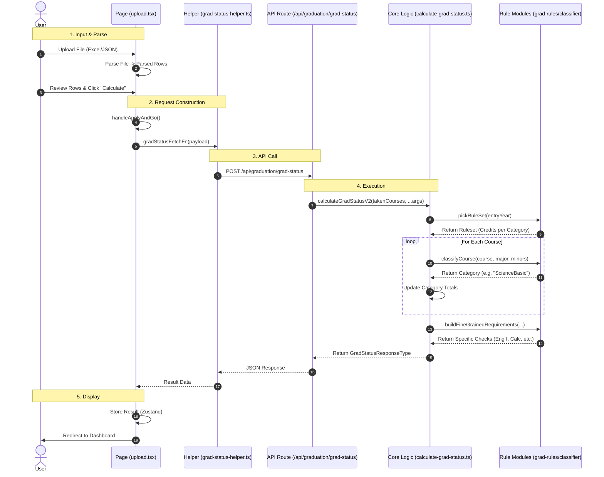

# Legacy Graduation Service Flow

This document describes the **Existing (Legacy)** architecture for graduation evaluation, which is currently used by the production `upload.tsx` page.

## System Sequence Diagram

The following diagram shows how the data travels from the User Interface to the API and back.

## detailed Component Breakdown

### 1. Frontend (`pages/dashboard/graduation/upload.tsx`)

- **Responsibility**: Files parsing, user confirmation, and initiating the calculation.
- **Key Function**: `handleApplyAndGo`
  - Gathers `takenCourses`, `entryYear`, `major` from state.
  - Calls `gradStatusFetchFn`.

### 2. API Helper (`lib/utils/graduation/grad-status-helper.ts`)

- **Responsibility**: Abstraction of the network request.
- **Key Function**: `gradStatusFetchFn`
  - Sends a `POST` request with the JSON payload.

### 3. API Endpoint (`pages/api/graduation/grad-status.ts`)

- **Responsibility**: Server-side entry point.
- **Action**: Extracts parameters (`takenCourses`, `entryYear`, `userMajor`, `userMinors`) from the request body and invokes the calculation logic.

### 4. Core Logic (`lib/utils/graduation/calculate-grad-status.ts`)

- **Responsibility**: The monolithic function containing the domain logic.
- **Key Function**: `calculateGradStatusV2`
  - **Step A**: Validation (Basic checks).
  - **Step B**: Rule Selection (`pickRuleSet` from `grad-rules.ts`).
  - **Step C**: Classification (`classifyCourse` from `grad-classifier.ts`).
    - Determines if a course is a Major, Minor, or General Elective.
  - **Step D**: Calculation.
    - Sums up credits for each category.
    - Calculates deficits (Current - Required).
  - **Step E**: Detailed Requirements (`buildFineGrainedRequirements` from `grad-requirements.ts`).
    - Checks for specific mandatory courses (e.g., "GS1601 English I").

### 5. Data Flow Summary

1.  **Input**: `UserTakenCourseListType` (List of courses).
2.  **Process**:
    - Iterate list -> Classify -> Accumulate.
    - Check Conditions -> Set `satisfied` flags.
3.  **Output**: `GradStatusResponseType` (Nested object with category status, messages, and totals).
