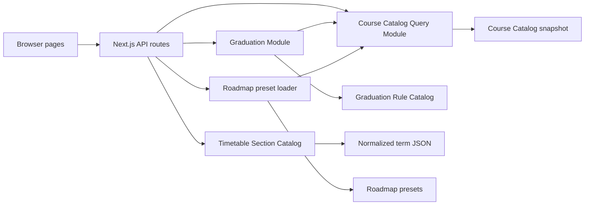

# 아키텍처

## 전체 구성

Gijol은 Next.js 13 Pages Router 애플리케이션입니다. 페이지와 API route가 전달 계층을 담당하고, `features/`의 도메인별 Module이 기능을 소유합니다. 공통 타입·상태·호환 유틸은 `lib/`, 게시 가능한 정적 데이터는 `DB/`와 각 feature의 `generated/`에 둡니다.

## 디렉터리 책임

| 경로 | 책임 |
| --- | --- |
| `pages/` | 페이지 조합, HTTP 입력 검증, 응답 status |
| `components/` | feature에 종속되지 않는 UI와 layout runtime |
| `features/graduation/` | 성적 이력 정규화 이후의 판정·추천·표시 모델 |
| `features/course-catalog/` | 과목 identity, 이력, facet, 관계의 통합과 서버 질의 |
| `features/timetable/` | 분반 탐색과 시간표 계획 모델 |
| `features/roadmap/` | React Flow 편집 UI와 과목 후보 조회 |
| `lib/stores/` | 브라우저 영속 상태와 migration |
| `lib/types/` | 여러 Module이 공유하는 transport·저장 타입 |
| `DB/` | 배포에 포함되는 정규화 데이터와 preset |
| `scripts/` | 카탈로그 생성·검증·보고서·bundle 검사 |

## 페이지 runtime

`pages/_app.tsx`는 global CSS, SEO, 로컬 폰트, Analytics만 소유합니다. 대시보드 기능은 페이지별 `getLayout` Interface로 선택합니다.

| runtime | 추가하는 기능 |
| --- | --- |
| `dashboardLayout` | 공통 대시보드 shell |
| `graduationLayout` | 대시보드 shell + toast overlay |
| `timetableLayout` | 대시보드 shell + React Query cache/devtools |

공개 페이지가 대시보드 상태, Sheet, React Query를 shared chunk로 끌어오지 않게 하는 구조이며 [ADR-0010](../adr/0010-scope-dashboard-runtime-by-page.md)에서 결정 이유를 설명합니다.

## 서버 소유 데이터

대용량 정적 snapshot은 브라우저가 직접 import하지 않습니다.

- `server-catalog-query.ts`가 과목 snapshot과 process-local index를 소유합니다.
- `server-section-catalog.ts`가 학기별 분반 JSON을 읽고 term별 browser를 cache합니다.
- API route는 page projection 또는 detail projection만 반환합니다.
- 브라우저 Module은 생성 snapshot의 구현이 아니라 API Interface에 의존합니다.

이 Seam은 현재 file Adapter를 이후 DB Adapter로 교체할 수 있게 하며, 관련 결정은 [ADR-0006](../adr/0006-server-owned-course-catalog-query.md), [ADR-0007](../adr/0007-separate-course-list-and-detail-projections.md), [ADR-0009](../adr/0009-share-section-browsing-not-plan-storage.md)에 있습니다.

## 상태 소유권

- 졸업 정보는 원본 성적 이력과 학적 컨텍스트만 durable state입니다.
- 졸업 판정과 추천은 API로 다시 계산하는 derived state입니다.
- 시간표 계획과 실제 이수 학기 기록은 서로 다른 데이터입니다.
- 로드맵 preset은 서버 파일이며, 사용자 편집 상태는 React Flow UI가 다룹니다.

전역 shell에는 졸업 성적 전체가 아니라 `hasData`, `lastUploadDate`만 가진 metadata store를 연결합니다. 상세한 persistence 구조는 [졸업 판정 엔진](graduation-engine.md#브라우저-영속화)에 설명합니다.
