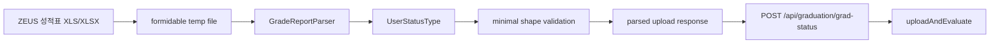
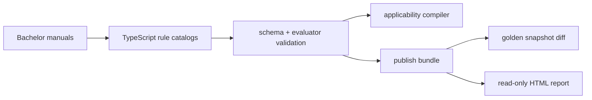

# 데이터 파이프라인

## 데이터 계층

| 계층 | 예 | Git 정책 |
| --- | --- | --- |
| 원본 증거 | 학사편람 PDF, 수강신청 XLS, 사용자 성적표 | 로컬/외부 보관, 커밋하지 않음 |
| 정규화 입력 | `DB/timetable/registration-system/*.normalized.json` | 커밋 |
| 게시 snapshot | `features/course-catalog/generated/*.json` | 커밋 |
| 런타임 projection | 검색 page, 졸업 추천, 로드맵 detail | 서버에서 계산 |
| 브라우저 durable state | 성적 이력, 학적 컨텍스트, 시간표 계획 | localStorage |

원본 경로와 hash는 정규화 데이터의 provenance로 남기되 원본 파일 자체는 저장소에 포함하지 않습니다.

## 성적표 파싱

`POST /api/graduation/upload`는 최대 10MB의 multipart 파일을 serverless 임시 디렉터리에 받고 `parseGradeBuffer()`로 전달합니다.

현재 parser가 읽는 셀은 다음과 같습니다.

| 열/셀 | 의미 |
| --- | --- |
| `A2` | `StudentNo.:<학번>` 형식의 학번 |
| `A` | 학교 이수구분 |
| `B` | 과목 코드 |
| `D` | 과목명 또는 학기 구분 행 |
| `E` | 학점 |
| `F` | 성적 |

4행부터 순회하며 D열의 `<연도/학기>` 표식으로 현재 학기를 바꾸고, B열에 `[학사]`가 나타나면 종료합니다. 코드 집합에 포함된 과목은 학교 이수구분을 HUS/PPE/GSC로 보정합니다. 일반 과목의 재수강은 같은 코드의 더 높은 성적을 남기고, `UC9331`처럼 반복 가능한 과목은 별도로 유지합니다.

파싱 성공 shape는 `{ studentId, userTakenCourseList }`입니다. 졸업 판정 단계에서는 이를 `{ takenCourses }`로 바꾸고 문자열, 성적 상태, 재수강을 다시 정규화합니다. F/U처럼 학점을 얻지 못한 시도는 durable transcript에는 남을 수 있지만 판정 입력에서는 제외됩니다.

## 졸업 규칙 게시 파이프라인

PDF는 provenance이며 런타임에 파싱하지 않습니다. 각 rule은 `sourceRefs`, `appliesTo`, `scope`, `parameters`를 갖고, 계산형 규칙만 등록된 `evaluatorId`를 참조합니다.

## 수강신청 분반 정규화

`course-catalog:import-registration-offerings`는 로컬 `llm/course_info_from_registration_system/*.xls`를 읽습니다.

1. 파일명 `YYYY_SS_*`에서 term을 구합니다.
2. `교과목-분반`, 시간, 강의실, 교수, 정원과 강/실/학 값을 `SectionOffering`으로 변환합니다.
3. 원본 SHA-256과 항목 수를 포함한 term JSON을 `DB/timetable/registration-system/`에 기록합니다.
4. 모든 term과 기본 최신 term을 `registration-timetable-sources.json`에 게시합니다.

시간은 요일과 `HH:MM` 범위의 `Meeting[]`으로, 교수는 이름과 선택적 교번의 배열로 정규화됩니다.

## 과목 카탈로그 통합

과목 카탈로그 builder는 다음 Adapter의 결과를 하나의 `CourseCatalogSnapshot`으로 합칩니다.

- `DB/course_db.csv`의 과목 identity
- 학기별 `SectionOffering`
- 학사편람 수록 이력
- 졸업 추천·부전공·로드맵 facet
- 동등과목·교차개설·학수번호 변경 관계

먼저 primary code와 alias를 통해 `courseId`를 결정하고, 아직 identity가 없는 관측 과목은 `COURSE:<code>` synthetic ID로 포함합니다. 이후 개설 이력, manual listing, requirement facet, relationship을 같은 `courseId`에 연결합니다.

자세한 snapshot 구조와 갱신 명령은 [과목 카탈로그](course-catalog.md)를 참고합니다.

## 편람 재추출의 검증 경계

학사편람 추출은 과목 제목과 연결된 강·실·학 또는 연구학점 표기를 읽는다. 다른 과목의 값을 가져오지 않으며 값이 없으면 미상으로 남긴다. 2021/2022 스캔은 한국어·영어 OCR을 사용한다. PDF SHA-256, OCR 캐시의 전체 연속 페이지, 게시 수록 이력의 값 보존을 `course-catalog:audit-handbooks`로 검사한다.

학사편람에서만 추출된 코드가 canonical identity와 연결되지 않으면 현재 게시 adapter에서 제외될 수 있다. 원시 추출에는 보존되며 감사 결과의 연도별 `unpublishedCodes`를 확인해야 한다. 수강신청/CSV 관측 과목의 synthetic 생성과 이 경로는 동일하지 않다. 이 누락을 0건이라고 가정하거나 미확인 OCR 코드를 자동으로 실제 과목에 병합하지 않는다.
