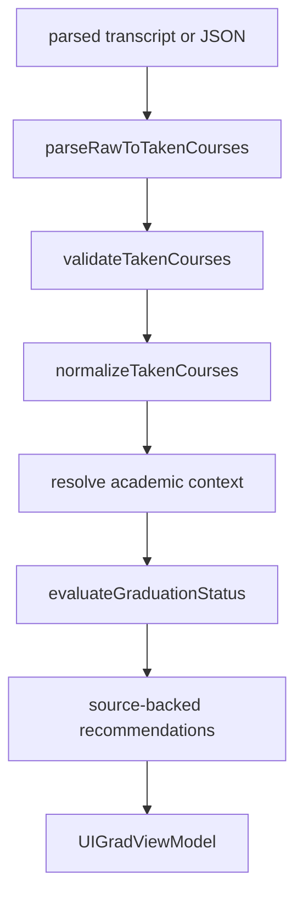

# 졸업 판정 엔진

## 판정 흐름

`features/graduation/usecases/uploadAndEvaluate.ts`가 판정 UseCase의 오케스트레이션 Interface입니다.

1. 입력 shape를 `{ takenCourses }`로 통일합니다.
2. 과목명과 학점 같은 최소 의미 조건을 검증합니다.
3. 문자열·성적 상태를 정규화하고 미취득/재수강을 처리합니다.
4. 학번에서 입학년도를 추론하고 전공 alias를 표준 전공 코드로 해석합니다.
5. 규칙 카탈로그와 명명된 판정기로 영역별 결과를 계산합니다.
6. 서버 과목 카탈로그에서 아직 충족하지 못한 요건의 추천 후보를 만듭니다.
7. UI가 소비하는 category, 세부요건, source, 추천 projection을 반환합니다.

## 핵심 입력 타입

`TakenCourseType`은 연도, 학기, 학교 이수구분, 과목명, 과목 코드, 학점, 성적과 `gradeStatus`를 가집니다. `gradeStatus`는 다음 셋 중 하나입니다.

- `official`: 확정 성적
- `in_progress`: 빈 성적 등 수강 중 상태
- `provisional`: 근거가 확정되지 않은 임시 상태

판정 컨텍스트는 입학년도, program kind별 코드, 선언 학기와 평가 학기를 포함합니다. 전공·부전공에 필요한 컨텍스트가 없으면 규칙을 임의 적용하지 않고 `needs_review`로 반환합니다.

## 규칙 카탈로그

`RuleCatalogRule`의 주요 필드는 다음과 같습니다.

| 필드 | 의미 |
| --- | --- |
| `id` | 게시 묶음 안에서 유일한 안정 ID |
| `kind` | 학점, 과목 수, 활동 횟수, 제한 등 규칙 유형 |
| `scope` | global, program kind 또는 특정 program code |
| `parameters` | 요구 학점·과목 목록·제한 수 같은 수정 가능한 값 |
| `appliesTo` | 입학년도, 선언 학기, 시행 학기 조건 |
| `sourceRefs` | 학사편람 연도·페이지·경로 |
| `evaluatorId` | 선언형 데이터만으로 표현하기 어려운 계산 로직 |

게시 가능한 규칙은 source, 적용조건, scope, parameters와 evaluator 계약을 검증합니다. compiler는 한 학생의 컨텍스트에 대해 규칙을 `applicable`, `does_not_apply`, `needs_context`로 나눕니다.

`GRADUATION_CATALOG_PUBLISH_BUNDLE`은 다음을 함께 게시합니다.

- source layer metadata
- 통합 graduation rule catalog
- course equivalencies

## 결과 구조

최종 결과는 boolean 하나가 아니라 다음 3상태입니다.

- `satisfied`
- `unsatisfied`
- `needs_review`

하위 호환용 `totalSatisfied`는 `overallStatus === 'satisfied'`일 때만 true입니다. 영역별 category와 `FineGrainedRequirement[]`에는 요구/취득/부족 학점, 매칭 과목, 제한으로 제외된 과목, source가 포함됩니다.

## 추천

추천은 browser 상수에서 임의 생성하지 않습니다. 서버 과목 카탈로그의 requirement facet, 전공·부전공 facet을 사용합니다.

- 이미 이수한 과목은 제외합니다.
- `needs_review` 요건은 컨텍스트가 없으므로 추천하지 않습니다.
- 전체/영역/요건별 표시 상한을 적용합니다.
- 전체 후보와 화면 표시 후보, 숨김 사유를 모두 ViewModel에 보존합니다.

## 브라우저 영속화

`useGraduationStore`가 저장하는 canonical durable state는 다음뿐입니다.

- grade-preserving `parsed` transcript
- `userMajor`, `userMinors`, `minorDeclarationTerms`, `entryYear`
- `lastUploadDate`

`takenCourses`는 transcript에서 즉시 재생성하고, `gradStatus`와 추천은 hydration 뒤 `/api/graduation/grad-status`로 다시 계산합니다. 요청 중 새 업로드가 발생하면 `lastUploadDate` revision 비교로 오래된 응답이 새 상태를 덮어쓰지 못하게 합니다.

전역 대시보드 shell은 별도 metadata store의 `hasData`, `lastUploadDate`만 읽습니다. 이 결정과 migration 정책은 [ADR-0008](../adr/0008-separate-durable-graduation-inputs.md)에 기록되어 있습니다.
