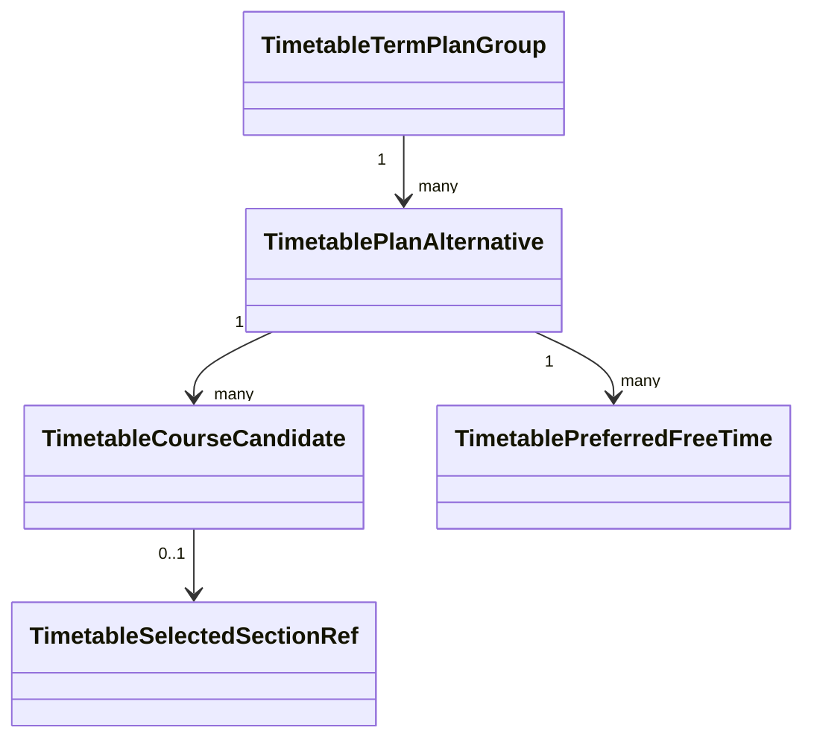

# 시간표와 로드맵

## 시간표 분반 탐색

`GET /api/timetable/[term]`은 term manifest를 확인한 뒤 `TimetableSectionCatalog`에 질의를 전달합니다. file Adapter는 정규화된 term JSON을 읽고, 서버 Module은 term별 `SectionBrowser`를 한 번 생성해 cache합니다.

질의는 검색어, 부서, 학사/대학원 level, 과목 코드, page, page size를 지원합니다. 기본 page 크기는 30, 최대는 100입니다. 응답은 목록, page 정보, 부서 facet과 학사/대학원 항목 수를 포함합니다.

브라우저에서는 React Query가 term과 query별 page cache 및 취소 신호를 관리합니다.

## 분반 데이터

`SectionOffering`은 다음 정보를 가집니다.

- 학과, 과목 코드, 분반, 과목명, 이수구분, 과정
- 강의/실험/학점
- `Meeting[]`과 강의실
- 정원과 확정 여부
- 교수 목록, 언어, syllabus/video 링크

분반의 안정 key는 정규화한 과목 코드와 분반을 결합한 `<COURSE_CODE>-<SECTION>`입니다.

## 시간표 계획 모델

### `TimetableTermPlanGroup`

계획 대상 학기, 분반 정보 상태, plan ID 목록과 대표 plan ID를 가집니다. 과목이나 분반 자체를 소유하지 않습니다.

### `TimetablePlanAlternative`

한 학기의 비교 가능한 계획 하나입니다. 이름, `preparing | section_selectable` 상태, 과목 후보와 선호 빈 시간대를 소유합니다. 첫 plan은 대표가 되지만 이후 마지막 수정 plan이 자동 대표가 되지는 않습니다.

### `TimetableCourseCandidate`

로드맵, 졸업요건, 직접 추가의 여러 근거를 가질 수 있습니다. 같은 정규화 과목 코드는 하나의 후보로 병합합니다. 분반을 고른 뒤에도 후보는 유지되고 `selectedSection` snapshot을 연결합니다.

선택 분반은 최소 snapshot을 plan에 저장하므로 원본 term JSON이 갱신되어도 사용자가 저장한 계획을 표시할 수 있습니다.

시간표 계획은 실제 이수 증거가 아닙니다. 성적표의 이수 학기 기록과 자동 병합하거나 삭제하지 않는 결정은 [ADR-0004](../adr/0004-separate-timetable-plans-from-completed-term-records.md)에 있습니다.

## 충돌과 선호

- 선택된 분반끼리 시간이 겹치면 시간 충돌입니다.
- 분반과 선호 빈 시간대가 겹치는 것은 부드러운 선호 위반이며 등록을 막지 않습니다.
- 분반이 공개되지 않은 학기도 후보와 선호를 가진 `preparing` plan을 만들 수 있습니다.

## 로드맵

로드맵 preset은 `DB/roadmap/presets/*.json`의 node/edge graph입니다. 각 node는 과목 코드, label, 학점, category, semester와 `COMPLETED | AVAILABLE | LOCKED` 상태를 가집니다.

`GET /api/roadmap/[slug]`는 slug를 정제해 preset을 읽고 서버 과목 카탈로그로 node를 enrich합니다. 결과에는 canonical course identity, alias, 학사편람 이력과 개설 분반 그룹이 포함될 수 있습니다.

로드맵 편집기의 과목 후보는 전체 snapshot을 받지 않고 `GET /api/roadmap/courses`의 page Interface를 사용합니다. 로드맵이 시간표에 전달하는 것은 과목 후보이며, 실제 분반 선택은 시간표 Module이 담당합니다.
