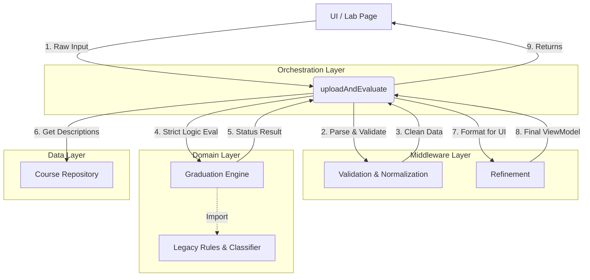

# Graduation Feature Module (`features/graduation`)

This module encapsulates the new, clean architecture for graduation requirement evaluation.
It replaces the legacy monolithic logic with a structured, layered approach.

## Directory Structure

```text
features/graduation/
├── data/           # Data Repositories & Adapters (Course Metadata, Recommendations)
├── domain/         # Pure Business Logic
│   └── engine/     # The Core Calculation Engine
├── middlewares/    # Input/Output Transformation
│   ├── validation/ # Input Validation & Normalization
│   └── refine/     # Output Refinement for UI (ViewModel creation)
└── usecases/       # Application Logic (Orchestrator)
    └── uploadAndEvaluate.ts
```

## Operation Flow Diagram

This diagram visualizes how the components interacts during a single evaluation request.



## Component Roles

### 1. `usecases/`

- **Role**: The entry point for the feature. It coordinates the data flow between layers.
- **Key File**: `uploadAndEvaluate.ts`.

### 2. `middlewares/`

- **Role**: Handles "dirty" work at the boundaries.
- **Validation**: Ensures incoming JSON matches the implementation contract.
- **Refinement**: Decorates the raw business result with UI-specific fields (e.g., help messages, color codes).

### 3. `domain/`

- **Role**: Pure business logic. It does not know about the UI or the Network.
- **Engine**: Calculates credits, checks specific course requirements, and determines graduation status.

### 4. `data/`

- **Role**: Interface to the outside world (Database, external APIs).
- **Goal**: In the future, this will fetch real-time course metadata instead of using mocks.
