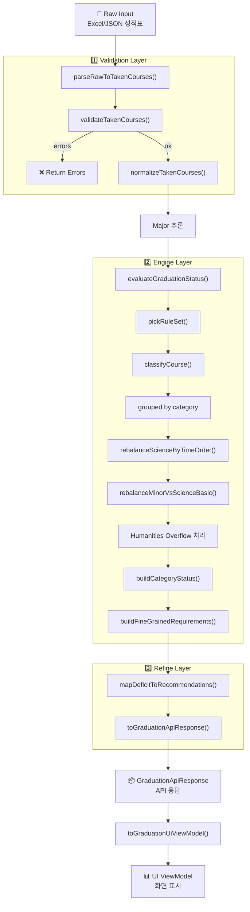

# 졸업요건 검증 로직 전체 흐름도

> 이 문서는 성적표 업로드부터 졸업요건 결과 화면까지의 전체 데이터 흐름과 각 함수의 역할을 상세히 기술합니다.

---

## 목차

1. [아키텍처 개요](#아키텍처-개요)
2. [전체 파이프라인 흐름도](#전체-파이프라인-흐름도)
3. [계층별 상세 설명](#계층별-상세-설명)
4. [핵심 함수 레퍼런스](#핵심-함수-레퍼런스)
5. [문제점 및 개선 방안](#문제점-및-개선-방안)
6. [유지보수 가이드](#유지보수-가이드)

---

## 아키텍처 개요

```
┌─────────────────────────────────────────────────────────────────────────┐
│                              PRESENTATION                                │
│  (pages/dashboard/graduation/upload.tsx)                                │
└──────────────────────────────┬──────────────────────────────────────────┘
                               │ rawInput (Excel/JSON)
                               ▼
┌─────────────────────────────────────────────────────────────────────────┐
│                               USECASE                                    │
│  usecases/uploadAndEvaluate.ts                                          │
│  └── uploadAndEvaluate()                                                │
└──────────────────────────────┬──────────────────────────────────────────┘
                               │
        ┌──────────────────────┴──────────────────────┐
        ▼                                              ▼
┌───────────────────┐                    ┌───────────────────────────────┐
│   MIDDLEWARES     │                    │           DOMAIN              │
│ ├─ validation/    │                    │ ├─ classifier.ts              │
│ │  └─ index.ts    │                    │ ├─ engine/index.ts            │
│ └─ refine/        │                    │ ├─ requirements.ts            │
│    └─ index.ts    │                    │ ├─ rules.ts                   │
└───────────────────┘                    │ └─ constants/                 │
                                         └───────────────────────────────┘
                                                       │
                                                       ▼
                                         ┌───────────────────────────────┐
                                         │            DATA               │
                                         │ └─ data/index.ts              │
                                         │    (추천 과목 조회)            │
                                         └───────────────────────────────┘
```

---

## 전체 파이프라인 흐름도



---

## 계층별 상세 설명

### 1. Usecase Layer

**파일:** [usecases/uploadAndEvaluate.ts](features/graduation/usecases/uploadAndEvaluate.ts)

```typescript
uploadAndEvaluate(rawInput, options) → UploadEvaluateResult
```

| 단계 | 함수 | 설명 |
|------|------|------|
| 0 | Metadata Extraction | `studentId`에서 입학년도 추론 (예: "20205098" → 2020) |
| 1 | `parseRawToTakenCourses()` | 원본 데이터를 `UserTakenCourseListType`으로 변환 |
| 2 | `validateTakenCourses()` | 필수 필드 검증 (courseName, credit 등) |
| 3 | `normalizeTakenCourses()` | 문자열 정리, F학점 제거, 재수강 처리 |
| 3.5 | Major Inference | 과목 prefix 빈도로 전공 추론 |
| 4 | `evaluateGraduationStatus()` | 핵심 엔진 호출 |
| 5 | `mapDeficitToRecommendations()` | 부족 학점에 대한 추천 과목 생성 |
| 6 | `toGraduationApiResponse()` | API 계약(`GraduationApiResponse`) 조합 |

---

### 2. Validation Layer

**파일:** [middlewares/validation/index.ts](features/graduation/middlewares/validation/index.ts)

#### `parseRawToTakenCourses(raw: unknown)`
- 입력 형태 자동 감지: `{ takenCourses: [...] }`, `{ userTakenCourseList: [...] }`, `[...]`
- 잘못된 입력 시 빈 배열 반환

#### `validateTakenCourses(input)`
- `courseName` 필수
- `year` 범위 검증 (1900 ~ 현재연도+1)
- `semester` 유효값 검증 (`1`, `2`, `여름`, `겨울` 계열)
- `credit` 범위 검증 (0 ~ 12)
- `grade` 포맷 검증
- `courseCode` 정규화 후 유효성 검증
- 실패 시 에러 배열 반환

#### `normalizeTakenCourses(input)`
```
1. 문자열 trim() 처리
2. 학기 문자열 표준화 (봄/가을/spring/fall 등 -> `1`/`2`)
3. 과목코드/성적 정규화 (대문자 + 불필요 문자 제거)
4. F학점 과목 필터링
5. 재수강 처리 (courseCode 기준 중복 제거, 높은 성적 우선)
6. 반복 수강 가능 과목 예외 처리 (UC9331 콜로퀴움 등)
```

---

### 3. Domain Layer - Classifier

**파일:** [domain/classifier.ts](features/graduation/domain/classifier.ts)

#### `classifyCourse(course, userMajor, userMinors) → CategoryKey`

**분류 우선순위 (순서대로 검사):**

| 순위 | 조건 | 반환값 |
|------|------|--------|
| 1 | `ETC_MANDATORY_CODES.has(code)` | `etcMandatory` |
| 2 | 학사논문연구 (suffix 9102, 9103) | `major` |
| 3 | 부전공 매칭 `matchesMinor()` | `minor` |
| 4 | 전공 매칭 (prefix 또는 전공코드) | `major` |
| 5 | **GSC_COURSES.has(code)** ⭐ | `humanities` |
| 6 | `SCIENCE_BASIC_CODES.has(code)` | `scienceBasic` |
| 7 | `SCIENCE_KEYWORDS` 매칭 | `scienceBasic` |
| 8 | 인문사회 패턴/키워드 | `humanities` |
| 9 | 기타 | `otherUncheckedClass` |

> ⚠️ **중요:** GSC 과목 체크가 SCIENCE_KEYWORDS보다 먼저 수행되어야 "수학의 위대한 순간들" 같은 과목이 올바르게 인문사회로 분류됨

---

### 4. Domain Layer - Engine

**파일:** [domain/engine/index.ts](features/graduation/domain/engine/index.ts)

#### `evaluateGraduationStatus(input, deps?)` - 핵심 함수

**처리 흐름:**

```
1. pickRuleSet(entryYear) → 입학년도별 규칙 선택
   ├─ ruleSet2018to2020
   └─ ruleSet2021Plus

2. 과목 분류 (classifyCourse)
   └─ grouped = { major: [], minor: [], humanities: [], scienceBasic: [], ... }

3. 기초과학 재조정 (rebalanceScienceByTimeOrder)
   └─ 시간순으로 3분야 완료 판정

4. 부전공 vs 기초과학 재분배 (rebalanceMinorVsScienceBasic)
   └─ 기초과학 17학점 우선 충족 후 남은 과목을 부전공에 배정

5. 인문사회 Overflow 처리
   ├─ 24학점 초과분 최대 12학점까지 자유선택으로 이동
   └─ HUS/PPE 우선, GSC 과목은 overflow 우선 대상

6. 카테고리별 상태 생성 (buildCategoryStatus)
   └─ { totalCredits, satisfied, missingCredits, ... }

7. 세부 요건 생성 (buildFineGrainedRequirements)
   └─ 영어I, 영어II, 글쓰기, HUS, PPE, 전공필수 등 개별 체크
```

#### 주요 내부 함수

| 함수 | 역할 |
|------|------|
| `compareSemester()` | 학기 비교 (년도+학기) |
| `getFieldByCode()` | 과목코드 → 과학분야 (PHYSICS/CHEMISTRY/BIOLOGY/SW) |
| `groupCoursesByField()` | 분야별 과목 그룹화 |
| `verifyLabPrerequisite()` | 실험-강의 선이수 검증 |
| `checkFieldCompletion()` | 분야 완료 여부 (강의+실험) |
| `rebalanceScienceByTimeOrder()` | 시간순 3분야 선택 알고리즘 |
| `rebalanceMinorVsScienceBasic()` | 부전공 vs 기초과학 우선순위 |
| `buildCategoryStatus()` | 카테고리별 상태 객체 생성 |

---

### 5. Domain Layer - Requirements

**파일:** [domain/requirements.ts](features/graduation/domain/requirements.ts)

#### `buildFineGrainedRequirements(ctx: AnalyzeContext) → FineGrainedRequirement[]`

**생성하는 세부 요건 목록:**

| ID | 요건 | 필수학점 |
|----|------|----------|
| `total-credits` | 총 이수학점 | 130 |
| `language-english-i` | 영어 I | 2 |
| `language-english-ii` | 영어 II | 2 |
| `language-writing` | 글쓰기 | 3 |
| `science-calculus` | 미적분학 | - |
| `science-core-math` | 수학 선택 필수 | - |
| `science-total` | 기초과학 총 학점 | 17-18 |
| `science-sw-basic` | SW 기초 | - |
| `humanities-hus` | HUS 학점 | 6 |
| `humanities-ppe` | PPE 학점 | 6 |
| `humanities-total` | 인문사회 총 학점 | 24 |
| `etc-freshman` | GIST 새내기 | 1 |
| `etc-major-exploration` | 전공탐색 (2021+) | 1 |
| `etc-colloquium` | 콜로퀴움 | 2회 |
| `etc-science-economy` | 과학기술과 경제 | 1 |
| `arts`, `sports` | 예체능 | 2-4과목 |
| `major-credits` | 전공 학점 | 36 |
| `thesis-i`, `thesis-ii` | 학사논문연구 | 각 1 |

#### 주요 Helper 함수

| 함수 | 역할 |
|------|------|
| `isCourseType(c, type)` | HUS/PPE/GSC 타입 판별 |
| `findCoursesInSet()` | 코드셋에서 과목 검색 |
| `findCoursesWithSuffix()` | suffix로 과목 검색 |
| `courseBasedLabel()` | 동적 라벨 생성 |
| `creditBasedLabel()` | 학점 기반 라벨 생성 |

---

### 6. Domain Layer - Constants

**파일:** [domain/constants/classifier-constants.ts](features/graduation/domain/constants/classifier-constants.ts)

| 상수 | 설명 |
|------|------|
| `HUS_COURSES` | HUS 과목 코드 Set |
| `PPE_COURSES` | PPE 과목 코드 Set |
| `GSC_COURSES` | GSC 과목 코드 Set |
| `ALL_HUMANITIES_COURSES` | HUS + PPE + GSC 합집합 |
| `SCIENCE_BASIC_CODES` | 기초과학 과목 코드 |
| `SCIENCE_KEYWORDS` | 과학 과목 키워드 (수학, 물리 등) |
| `MAJOR_MANDATORY_RULES` | 전공별 필수과목 규칙 |
| `MINOR_MANDATORY_RULES` | 부전공별 필수과목 규칙 |

---

### 7. Refine Layer

**파일:** [middlewares/refine/index.ts](features/graduation/middlewares/refine/index.ts)

#### `toGraduationApiResponse(result, extra?)`

Engine 결과를 **API 계약 객체**로 변환:

```typescript
interface GraduationApiResponse {
  ...GradStatusResponseType,
  recommendations: RecommendationItem[],
  fineGrainedRequirements: FineGrainedRequirement[]
}
```

---

### 8. UI Mapper Layer

**파일:** [lib/utils/graduation/ui-mapper.ts](lib/utils/graduation/ui-mapper.ts)

#### `toGraduationUiViewModel(apiResponse)`

클라이언트에서 API 응답을 UI 모델로 변환:

```typescript
interface GraduationUiViewModel {
  ...GraduationApiResponse,
  displayMessage: string
}
```

---

### 9. Data Layer

**파일:** [data/index.ts](features/graduation/data/index.ts)

#### `mapDeficitToRecommendations(deficits, repo)`

부족한 학점/카테고리에 대한 추천 과목 생성

---

## 핵심 함수 레퍼런스

```
uploadAndEvaluate()
├── parseRawToTakenCourses()
├── validateTakenCourses()
├── normalizeTakenCourses()
├── evaluateGraduationStatus()
│   ├── pickRuleSet()
│   ├── classifyCourse() ← 과목 분류 핵심
│   │   └── matchesMinor()
│   ├── rebalanceScienceByTimeOrder()
│   │   ├── getFieldByCode()
│   │   ├── groupCoursesByField()
│   │   ├── checkFieldCompletion()
│   │   └── verifyLabPrerequisite()
│   ├── rebalanceMinorVsScienceBasic()
│   ├── buildCategoryStatus()
│   └── buildFineGrainedRequirements()
│       ├── isCourseType()
│       ├── findCoursesInSet()
│       ├── sumCredits()
│       └── courseBasedLabel() / creditBasedLabel()
├── mapDeficitToRecommendations()
└── toGraduationApiResponse()

[Client]
└── toGraduationUiViewModel()
```

---

## 문제점 및 개선 방안

### 🔴 현재 문제점

#### 1. 분류 우선순위 충돌
**문제:** `classifier.ts`에서 SCIENCE_KEYWORDS가 GSC 과목보다 먼저 체크되어 "수학의 위대한 순간들" 같은 GSC 과목이 scienceBasic으로 잘못 분류됨

**영향:** 인문사회 학점 미반영

**해결:** ✅ (2024-02-08 수정 완료) GSC_COURSES 체크를 SCIENCE_KEYWORDS 앞으로 이동

#### 2. 상수 분산 관리
**문제:** 과목 코드가 `lib/const/course-code-classification.ts`와 `features/graduation/domain/constants/classifier-constants.ts` 두 곳에 분산

**영향:** 과목 추가 시 누락 위험

**해결 방안:**
```typescript
// 단일 소스로 통합
// features/graduation/domain/constants/course-sets.ts
export { HUS_COURSES, PPE_COURSES, GSC_COURSES } from '@/lib/const/course-code-classification';
```

#### 3. 하드코딩된 규칙
**문제:** `requirements.ts`에 영어I, 글쓰기 등의 과목 코드가 하드코딩됨

**영향:** 과목 코드 변경 시 다수 파일 수정 필요

**해결 방안:**
```typescript
// constants에서 관리
export const REQUIREMENT_COURSE_SETS = {
  englishI: new Set(['GS1601', 'GS1603', 'GS1607']),
  englishII: new Set(['GS1602', 'GS1604', 'GS2652']),
  writing: new Set(['GS1511', 'GS1512', 'GS1513', 'GS1531', 'GS1532', 'GS1533', 'GS1535']),
  // ...
};
```

#### 4. 테스트 커버리지 부족
**문제:** GSC 과목의 humanities 분류에 대한 직접 테스트 없음

**해결 방안:**
```typescript
// tests/graduation_gsc.spec.ts
it('GSC 과목(GS2823)이 humanities로 분류되어야 함', () => {
  const result = classifyCourse({ courseCode: 'GS2823', ... }, 'EC');
  expect(result).toBe('humanities');
});
```

#### 5. Magic Number
**문제:** 24, 17, 12, 36 등의 숫자가 코드에 하드코딩됨

**해결 방안:**
```typescript
// domain/constants/graduation-rules.ts
export const GRADUATION_THRESHOLDS = {
  HUMANITIES_REQUIRED: 24,
  HUMANITIES_OVERFLOW_MAX: 12,
  SCIENCE_BASIC_WITH_COMP_PROG: 17,
  SCIENCE_BASIC_WITHOUT_COMP_PROG: 18,
  MAJOR_REQUIRED: 36,
  MINOR_REQUIRED: 15,
};
```

---

## 유지보수 가이드

### 📌 신규 과목 추가 시

1. **GSC/HUS/PPE 과목**
   - `lib/const/course-code-classification.ts`에 과목 코드 추가
   - `features/graduation/domain/constants/classifier-constants.ts`에도 동일하게 추가

2. **기초과학 과목**
   - `classifier-constants.ts`의 `SCIENCE_BASIC_CODES`에 추가

3. **전공 필수**
   - `classifier-constants.ts`의 `MAJOR_MANDATORY_RULES`에 규칙 추가

### 📌 학번별 규칙 변경 시

1. `domain/rules.ts`에서 해당 학번 규칙 수정
2. `pickRuleSet()` 조건문 확인
3. `requirements.ts`의 학번 분기 로직 확인

### 📌 새 카테고리 추가 시

1. `domain/types.ts`에 `CategoryKey` 추가
2. `classifier.ts`에 분류 로직 추가
3. `engine/index.ts`의 `grouped` 처리 추가
4. `requirements.ts`에 세부 요건 생성 로직 추가

### 📌 디버깅 체크리스트

| 증상 | 확인 위치 |
|------|-----------|
| 과목이 잘못된 카테고리에 분류됨 | `classifier.ts` 분류 순서 |
| 학점이 합산되지 않음 | `engine/index.ts` rebalance 로직 |
| 세부 요건이 미충족으로 표시됨 | `requirements.ts` Set 정의 |
| F학점 과목이 포함됨 | `validation/index.ts` 필터링 |

---

## 파일 맵

```
features/graduation/
├── usecases/
│   └── uploadAndEvaluate.ts    # 진입점, 파이프라인 오케스트레이션
├── middlewares/
│   ├── validation/
│   │   └── index.ts            # 파싱, 검증, 정규화
│   └── refine/
│       └── index.ts            # API 계약 조합
├── domain/
│   ├── classifier.ts           # 과목 분류 로직
│   ├── engine/
│   │   └── index.ts            # 핵심 평가 엔진
│   ├── requirements.ts         # 세부 요건 생성
│   ├── rules.ts                # 학번별 규칙
│   ├── types.ts                # 타입 정의
│   └── constants/
│       ├── classifier-constants.ts  # 과목 Set, 키워드
│       ├── course-code-sets.ts      # 과목 코드 집합
│       └── alias-mappings.ts        # 과목 코드 별칭
└── data/
    └── index.ts                # 추천 과목 조회

lib/utils/graduation/
└── ui-mapper.ts                # 클라이언트 UI ViewModel 생성
```
