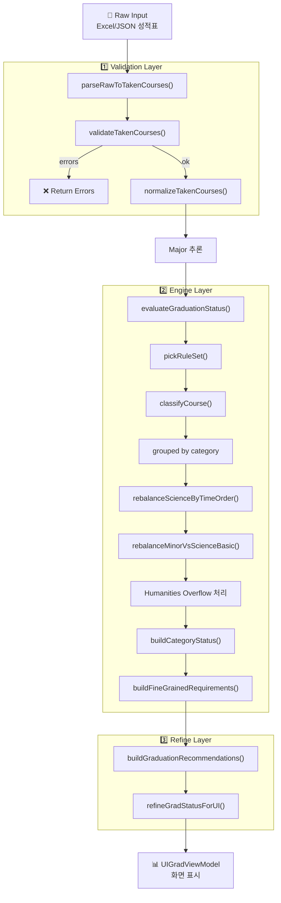

# 졸업요건 검증 로직 전체 흐름도

> 이 문서는 성적표 업로드부터 졸업요건 결과 화면까지의 전체 데이터 흐름과 각 함수의 역할을 상세히 기술합니다.

---

## 목차

1. [아키텍처 개요](#아키텍처-개요)
2. [전체 파이프라인 흐름도](#전체-파이프라인-흐름도)
3. [계층별 상세 설명](#계층별-상세-설명)
4. [핵심 함수 레퍼런스](#핵심-함수-레퍼런스)
5. [문제점 및 개선 방안](#문제점-및-개선-방안)
6. [유지보수 가이드](#유지보수-가이드)

---

## 아키텍처 개요

```
┌─────────────────────────────────────────────────────────────────────────┐
│                              PRESENTATION                                │
│  (pages/dashboard/graduation/upload.tsx)                                │
└──────────────────────────────┬──────────────────────────────────────────┘
                               │ rawInput (Excel/JSON)
                               ▼
┌─────────────────────────────────────────────────────────────────────────┐
│                               USECASE                                    │
│  usecases/uploadAndEvaluate.ts                                          │
│  └── uploadAndEvaluate()                                                │
└──────────────────────────────┬──────────────────────────────────────────┘
                               │
        ┌──────────────────────┴──────────────────────┐
        ▼                                              ▼
┌───────────────────┐                    ┌───────────────────────────────┐
│   MIDDLEWARES     │                    │           DOMAIN              │
│ ├─ validation/    │                    │ ├─ classifier.ts              │
│ │  └─ index.ts    │                    │ ├─ engine/index.ts            │
│ └─ refine/        │                    │ ├─ requirements.ts            │
│    └─ index.ts    │                    │ ├─ rules.ts                   │
└───────────────────┘                    │ ├─ rule-catalog/              │
                                         │ └─ constants/                 │
                                         └───────────────────────────────┘
                                                       │
                                                       ▼
                                         ┌───────────────────────────────┐
                                         │            DATA               │
                                         │ └─ data/index.ts              │
                                         │    (추천 과목 조회)            │
                                         └───────────────────────────────┘
```

---

## 전체 파이프라인 흐름도


```mermaid
flowchart TD
    A[📄 Raw Input<br/>Excel/JSON 성적표] --> B["parseRawToTakenCourses()"]
    
    subgraph VALIDATION ["1️⃣ Validation Layer"]
        B --> C["validateTakenCourses()"]
        C -->|errors| E[❌ Return Errors]
        C -->|ok| D["normalizeTakenCourses()"]
    end
    
    D --> F["Major 추론"]
    F --> G["evaluateGraduationStatus()"]
    
    subgraph ENGINE ["2️⃣ Engine Layer"]
        G --> H["pickRuleSet()"]
        H --> I["classifyCourse()"]
        I --> J["grouped by category"]
        J --> K["rebalanceScienceByTimeOrder()"]
        K --> L["rebalanceMinorVsScienceBasic()"]
        L --> M["Humanities Overflow 처리"]
        M --> N["buildCategoryStatus()"]
        N --> O["buildFineGrainedRequirements()"]
    end
    
    O --> P["buildGraduationRecommendations()"]
    
    subgraph REFINE ["3️⃣ Refine Layer"]
        P --> Q["refineGradStatusForUI()"]
    end
    
    Q --> R[📊 UIGradViewModel<br/>화면 표시]
```

---

## 계층별 상세 설명

### 1. Usecase Layer

**파일:** [usecases/uploadAndEvaluate.ts](features/graduation/usecases/uploadAndEvaluate.ts)

```typescript
uploadAndEvaluate(rawInput, options) → UploadEvaluateResult
```

| 단계 | 함수 | 설명 |
|------|------|------|
| 0 | Metadata Extraction | `studentId`에서 입학년도 추론 (예: "20205098" → 2020) |
| 1 | `parseRawToTakenCourses()` | 원본 데이터를 `UserTakenCourseListType`으로 변환 |
| 2 | `validateTakenCourses()` | 필수 필드 검증 (courseName, credit 등) |
| 3 | `normalizeTakenCourses()` | 문자열 정리, F학점 제거, 재수강 처리 |
| 3.5 | Major Inference | 과목 prefix 빈도로 전공 추론 |
| 4 | `evaluateGraduationStatus()` | 핵심 엔진 호출 |
| 5 | `buildGraduationRecommendations()` | 미충족 세부요건에 대한 source-backed 추천 과목 생성 |
| 6 | `refineGradStatusForUI()` | UI용 ViewModel 생성 |

---

### 2. Validation Layer

**파일:** [middlewares/validation/index.ts](features/graduation/middlewares/validation/index.ts)

#### `parseRawToTakenCourses(raw: unknown)`
- 입력 형태 자동 감지: `{ takenCourses: [...] }`, `{ userTakenCourseList: [...] }`, `[...]`
- 잘못된 입력 시 빈 배열 반환

#### `validateTakenCourses(input)`
- `courseName` 필수
- `credit` ≥ 0 검증
- 실패 시 에러 배열 반환

#### `normalizeTakenCourses(input)`
```
1. 문자열 trim() 처리
2. F학점 과목 필터링
3. 재수강 처리 (courseCode 기준 중복 제거, 높은 성적 우선)
4. 반복 수강 가능 과목 예외 처리 (UC9331 콜로퀴움 등)
```

---

### 3. Domain Layer - Classifier

**파일:** [domain/classifier.ts](features/graduation/domain/classifier.ts)

#### `classifyCourse(course, userMajor, userMinors) → CategoryKey`

**분류 우선순위 (순서대로 검사):**

| 순위 | 조건 | 반환값 |
|------|------|--------|
| 1 | `ETC_MANDATORY_CODES.has(code)` | `etcMandatory` |
| 2 | 학사논문연구 (suffix 9102, 9103) | `major` |
| 3 | 부전공 매칭 `matchesMinor()` | `minor` |
| 4 | 전공 매칭 (prefix 또는 전공코드) | `major` |
| 5 | **GSC_COURSES.has(code)** ⭐ | `humanities` |
| 6 | `SCIENCE_BASIC_CODES.has(code)` | `scienceBasic` |
| 7 | `SCIENCE_KEYWORDS` 매칭 | `scienceBasic` |
| 8 | 인문사회 패턴/키워드 | `humanities` |
| 9 | 기타 | `otherUncheckedClass` |

> ⚠️ **중요:** GSC 과목 체크가 SCIENCE_KEYWORDS보다 먼저 수행되어야 "수학의 위대한 순간들" 같은 과목이 올바르게 인문사회로 분류됨

---

### 4. Domain Layer - Engine

**파일:** [domain/engine/index.ts](graduation/domain/engine/index.ts)

#### `evaluateGraduationStatus(input, deps?)` - 핵심 함수

**처리 흐름:**

```
1. pickRuleSet(entryYear) → 입학년도별 규칙 선택
   ├─ ruleSet2018to2020
   └─ ruleSet2021Plus

2. 과목 분류 (classifyCourse)
   └─ grouped = { major: [], minor: [], humanities: [], scienceBasic: [], ... }

3. 기초과학 재조정 (rebalanceScienceByTimeOrder)
   └─ 시간순으로 3분야 완료 판정

4. 부전공 vs 기초과학 재분배 (rebalanceMinorVsScienceBasic)
   └─ 기초과학 17학점 우선 충족 후 남은 과목을 부전공에 배정

5. 인문사회 Overflow 처리
   ├─ 24학점 초과분 최대 12학점까지 자유선택으로 이동
   └─ HUS/PPE 우선, GSC 과목은 overflow 우선 대상

6. 카테고리별 상태 생성 (buildCategoryStatus)
   └─ { totalCredits, satisfied, missingCredits, ... }

7. 세부 요건 생성 (buildFineGrainedRequirements)
   └─ 영어I, 영어II, 글쓰기, HUS, PPE, 전공필수 등 개별 체크
```

#### 주요 내부 함수

| 함수 | 역할 |
|------|------|
| `compareSemester()` | 학기 비교 (년도+학기) |
| `getFieldByCode()` | 과목코드 → 과학분야 (PHYSICS/CHEMISTRY/BIOLOGY/SW) |
| `groupCoursesByField()` | 분야별 과목 그룹화 |
| `verifyLabPrerequisite()` | 실험-강의 선이수 검증 |
| `checkFieldCompletion()` | 분야 완료 여부 (강의+실험) |
| `rebalanceScienceByTimeOrder()` | 시간순 3분야 선택 알고리즘 |
| `rebalanceMinorVsScienceBasic()` | 부전공 vs 기초과학 우선순위 |
| `buildCategoryStatus()` | 카테고리별 상태 객체 생성 |

---

### 5. Domain Layer - Requirements

**파일:** [domain/requirements.ts](features/graduation/domain/requirements.ts)

#### `buildFineGrainedRequirements(ctx: AnalyzeContext) → FineGrainedRequirement[]`

**생성하는 세부 요건 목록:**

| ID | 요건 | 필수학점 |
|----|------|----------|
| `total-credits` | 총 이수학점 | 130 |
| `language-english-i` | 영어 I | 2 |
| `language-english-ii` | 영어 II | 2 |
| `language-writing` | 글쓰기 | 3 |
| `science-calculus` | 미적분학 | - |
| `science-core-math` | 수학 선택 필수 | - |
| `science-total` | 기초과학 총 학점 | 17-18 |
| `science-sw-basic` | SW 기초 | - |
| `humanities-hus` | HUS 학점 | 6 |
| `humanities-ppe` | PPE 학점 | 6 |
| `humanities-total` | 인문사회 총 학점 | 24 |
| `etc-freshman` | GIST 새내기 | 1 |
| `etc-major-exploration` | 전공탐색 (2021+) | 1 |
| `etc-colloquium` | 콜로퀴움 | 2회 |
| `etc-science-economy` | 과학기술과 경제 | 1 |
| `arts`, `sports` | 예체능 | 2-4과목 |
| `major-credits` | 전공 학점 | 36 |
| `thesis-i`, `thesis-ii` | 학사논문연구 | 각 1 |

#### 주요 Helper 함수

| 함수 | 역할 |
|------|------|
| `isCourseType(c, type)` | HUS/PPE/GSC 타입 판별 |
| `findCoursesInSet()` | 코드셋에서 과목 검색 |
| `findCoursesWithSuffix()` | suffix로 과목 검색 |
| `courseBasedLabel()` | 동적 라벨 생성 |
| `creditBasedLabel()` | 학점 기반 라벨 생성 |

---

### 6. Domain Layer - Constants

**파일:** [domain/constants/classifier-constants.ts](features/graduation/domain/constants/classifier-constants.ts)

| 상수 | 설명 |
|------|------|
| `HUS_COURSES` | HUS 과목 코드 Set |
| `PPE_COURSES` | PPE 과목 코드 Set |
| `GSC_COURSES` | GSC 과목 코드 Set |
| `ALL_HUMANITIES_COURSES` | HUS + PPE + GSC 합집합 |
| `SCIENCE_BASIC_CODES` | 기초과학 과목 코드 |
| `SCIENCE_KEYWORDS` | 과학 과목 키워드 (수학, 물리 등) |

기본요건은 `features/graduation/domain/rule-catalog/basic-requirements.ts`, 전공/부전공 세부요건은 `features/graduation/domain/rule-catalog/major-minor-requirements.ts`에서 관리한다.
게시 가능한 전체 졸업요건 boundary는 `features/graduation/domain/rule-catalog/catalog.ts`의 `GRADUATION_RULE_CATALOG`이며, 기본요건과 전공/부전공 세부요건 rule view를 하나로 합친다.
Catalog 운영 규칙, golden snapshot workflow, future draft/publish 저장소 설계는 `features/graduation/docs/RULE_CATALOG_OPERATIONS.md`를 따른다.
게시 가능한 졸업요건은 `features/graduation/domain/rule-catalog/schema.ts`의 rule schema와 validator를 통과해야 하며, 학사편람 연도(`sourceRefs.manualYear`)와 학생별 적용조건(`appliesTo`)은 분리해서 기록한다.
같은 런타임 요건이라도 적용조건이 다른 publish rule은 catalog rule ID를 고유하게 둔다. validator는 중복 ID, 원문 출처 누락, 적용조건 누락/충돌, 알 수 없는 `evaluatorId`를 publish 전에 잡는다.
계산형 특수 로직은 `features/graduation/domain/rule-catalog/rule-evaluator-registry.ts`에 등록된 evaluator만 참조할 수 있다. registry는 evaluator별 `kind`, `scope`, `parameters` 계약을 검증해 같은 ID를 잘못된 rule primitive에 붙이는 draft를 막는다.
Rule scope의 `programKind`는 `major`, `minor`, `double-major`, `advanced-major`를 표현할 수 있다. 현재 런타임 판정은 전공/부전공 중심이고, 복수전공/심화전공은 p.30 규칙을 나중에 source-backed rule/evaluator로 분리하기 위한 schema 기반만 열어둔다.
Compiler의 catalog selection은 `RequirementContext.programCodes`로 rule `scope`를 먼저 거른다. 프로그램 정보가 없으면 program-scoped rule은 applicable로 섞지 않고 `needs_context`로 분리한다.
선언 학기 적용조건은 기존 단일 `declarationTerm` 또는 program kind별 `declarationTerms` 학적 컨텍스트로 판정할 수 있다. 부전공 선언 학기와 복수전공 선언 학기는 같은 필드에 섞지 않는다.
Admin UI는 백로그로만 두고, 현재 관리 경계는 TS catalog와 JSON publish artifact로 둔다. `features/graduation/domain/rule-catalog/serialization.ts`는 publish snapshot이 `undefined`나 함수처럼 JSON 변환 중 손실되는 값을 포함하지 않는지 검증한다.
운영 확인은 `yarn graduation:catalog:check`로 수행한다. 이 명령은 통합 catalog의 publishable validator, JSON serialization, compiler, publish snapshot 생성을 한 번에 확인한다.
JSON artifact 내용 확인은 `yarn graduation:catalog:export`로 stdout에 출력하거나 `yarn graduation:catalog:export --out <path>`로 파일에 저장한다. export artifact는 `sourceLayers`, `ruleCatalog`, `courseEquivalencies`를 함께 담은 `GRADUATION_CATALOG_PUBLISH_BUNDLE`이다.
사람이 빠르게 검토할 요약은 `yarn graduation:catalog:inspect`로 확인한다. 이 명령은 source layer별 rule/equivalency coverage, rule kind/scope/applicability/evaluator 분포, 미참조 source layer를 출력한다.
브라우저에서 볼 수 있는 read-only report는 `yarn graduation:catalog:report --out <path>`로 생성한다. 이 report는 publish bundle을 시각화하는 정적 HTML이며, rule 수정/draft/publish 기능을 포함하지 않는다.
Report의 `Source Layer Coverage`는 실제 `sourceRefs`가 참조한 페이지만 집계한다. 2026 학사편람의 추적 대상 페이지가 왜 아직 `sourceRefs`로 연결되지 않았는지는 `Manual Page Audit` 섹션에서 확인한다.
2026 학사편람 p.32는 총학점/GPA rule의 보조 sourceRef로 참조한다. p.33~34가 입학년도별 표의 주 근거이고, p.32는 졸업요건 장 시작의 공통 근거다.
Golden snapshot 검증은 `yarn graduation:catalog:snapshot`으로 수행한다. 현재 publish bundle과 `tests/fixtures/graduation-catalog-publish-bundle.snapshot.json`을 비교하며, mismatch가 있으면 추가/삭제/변경된 source layer, rule, course equivalency ID를 출력한다.
Catalog 변경을 승인해 fixture를 갱신할 때는 report와 diff를 먼저 검토한 뒤 `yarn graduation:catalog:export --out tests/fixtures/graduation-catalog-publish-bundle.snapshot.json`을 실행한다.
`GRADUATION_CATALOG_PUBLISH_BUNDLE`은 bundle-level validator를 통과해야 한다. validator는 nested schemaVersion, source layer coverage, JSON 직렬화 가능 여부를 export 경계에서 다시 확인한다.
Source layer metadata는 `features/graduation/domain/rule-catalog/catalog-source-layers.ts`에서 관리한다. `sourceRefs.manualYear`는 적용 버전 키가 아니라 증거 문서의 연도이며, bundle의 source layer는 여러 연도 PDF에서 추출한 rule layer를 적층하기 위한 provenance 경계다.
검증된 rule은 `features/graduation/domain/rule-catalog/compiler.ts`에서 인덱싱하고, `appliesTo`를 `applies`, `does_not_apply`, `needs_context`로 판별한다.
수정 가능한 primitive 값은 rule `parameters`에 두고, 전공/부전공 같은 대상 범위는 rule `scope`에 둔다.
과목 코드 관계는 `features/graduation/domain/rule-catalog/course-equivalencies.ts`에서 별도 catalog로 관리한다. 현재는 p.23/p.25 근거의 화학/수리과학/환경·에너지/생명과학 대체·동일과목 후보를 담고 있으며, `crossListed`, `renumbered`, `legacyEquivalent`, `sameCourse`, `substitute` relation shape와 sourceRefs/JSON 직렬화를 검증한다. 아직 evaluator/classifier에는 연결하지 않는다.
`features/graduation/domain/constants/alias-mappings.ts`는 현재 런타임 alias 매칭 용도로 유지한다. 연도별 학수번호 변경이나 legacy equivalent를 alias map에 섞지 않는다.

---

### 7. Refine Layer

**파일:** [middlewares/refine/index.ts](features/graduation/middlewares/refine/index.ts)

#### `refineGradStatusForUI(result, extra?)`

Engine 결과를 UI용 ViewModel로 변환:

```typescript
interface UIGradViewModel {
  ...GradStatusResponseType,
  recommendations: RecommendationItem[],
  allRecommendations: RecommendationItem[],
  displayMessage: string,
  fineGrainedRequirements: FineGrainedRequirement[]
}
```

---

### 8. Data Layer

**파일:** [data/index.ts](features/graduation/data/index.ts)

#### `buildGraduationRecommendations(input)`

미충족 세부요건, 전공/부전공 컨텍스트, 이수/수강중 과목을 기준으로 source-backed 추천 과목을 생성한다.
추천 후보는 course-master/minor course catalog에 있는 데이터만 사용하며, 수강중 과목은 이미 target에 오른 과목으로 보고 제외한다.
추천 결과는 `RecommendationDisplayPolicy`로 전체/영역/요건별 상한을 적용한 대표 추천(`recommendations`)과, 같은 source-backed 후보를 cap 없이 보존한 전체 후보(`allRecommendations`)를 분리해 전달한다. 숨겨진 후보나 전공/부전공 컨텍스트 부족은 `recommendationSuppressions`로 UI ViewModel에 함께 전달한다.

---

## 핵심 함수 레퍼런스

```
uploadAndEvaluate()
├── parseRawToTakenCourses()
├── validateTakenCourses()
├── normalizeTakenCourses()
├── evaluateGraduationStatus()
│   ├── pickRuleSet()
│   ├── classifyCourse() ← 과목 분류 핵심
│   │   └── matchesMinor()
│   ├── rebalanceScienceByTimeOrder()
│   │   ├── getFieldByCode()
│   │   ├── groupCoursesByField()
│   │   ├── checkFieldCompletion()
│   │   └── verifyLabPrerequisite()
│   ├── rebalanceMinorVsScienceBasic()
│   ├── buildCategoryStatus()
│   └── buildFineGrainedRequirements()
│       ├── isCourseType()
│       ├── findCoursesInSet()
│       ├── sumCredits()
│       └── courseBasedLabel() / creditBasedLabel()
├── buildGraduationRecommendations()
└── refineGradStatusForUI()
```

---

## 문제점 및 개선 방안

### 🔴 현재 문제점

#### 1. 분류 우선순위 충돌
**문제:** `classifier.ts`에서 SCIENCE_KEYWORDS가 GSC 과목보다 먼저 체크되어 "수학의 위대한 순간들" 같은 GSC 과목이 scienceBasic으로 잘못 분류됨

**영향:** 인문사회 학점 미반영

**해결:** ✅ (2024-02-08 수정 완료) GSC_COURSES 체크를 SCIENCE_KEYWORDS 앞으로 이동

#### 2. 상수 분산 관리
**문제:** 과목 코드가 `lib/const/course-code-classification.ts`와 `features/graduation/domain/constants/classifier-constants.ts` 두 곳에 분산

**영향:** 과목 추가 시 누락 위험

**해결 방안:**
```typescript
// 단일 소스로 통합
// features/graduation/domain/constants/course-sets.ts
export { HUS_COURSES, PPE_COURSES, GSC_COURSES } from '@/lib/const/course-code-classification';
```

#### 3. 하드코딩된 규칙
**문제:** `requirements.ts`에 영어I, 글쓰기 등의 과목 코드가 하드코딩됨

**영향:** 과목 코드 변경 시 다수 파일 수정 필요

**해결 방안:**
```typescript
// constants에서 관리
export const REQUIREMENT_COURSE_SETS = {
  englishI: new Set(['GS1601', 'GS1603', 'GS1607']),
  englishII: new Set(['GS1602', 'GS1604', 'GS2652']),
  writing: new Set(['GS1511', 'GS1512', 'GS1513', 'GS1531', 'GS1532', 'GS1533', 'GS1535']),
  // ...
};
```

#### 4. 테스트 커버리지 부족
**문제:** GSC 과목의 humanities 분류에 대한 직접 테스트 없음

**해결 방안:**
```typescript
// tests/graduation_gsc.spec.ts
it('GSC 과목(GS2823)이 humanities로 분류되어야 함', () => {
  const result = classifyCourse({ courseCode: 'GS2823', ... }, 'EC');
  expect(result).toBe('humanities');
});
```

#### 5. Magic Number
**문제:** 24, 17, 12, 36 등의 숫자가 코드에 하드코딩됨

**해결 방안:**
```typescript
// domain/constants/graduation-rules.ts
export const GRADUATION_THRESHOLDS = {
  HUMANITIES_REQUIRED: 24,
  HUMANITIES_OVERFLOW_MAX: 12,
  SCIENCE_BASIC_WITH_COMP_PROG: 17,
  SCIENCE_BASIC_WITHOUT_COMP_PROG: 18,
  MAJOR_REQUIRED: 36,
  MINOR_REQUIRED: 15,
};
```

---

## 유지보수 가이드

### 📌 신규 과목 추가 시

1. **GSC/HUS/PPE 과목**
   - `lib/const/course-code-classification.ts`에 과목 코드 추가
   - `features/graduation/domain/constants/classifier-constants.ts`에도 동일하게 추가

2. **기초과학 과목**
   - `classifier-constants.ts`의 `SCIENCE_BASIC_CODES`에 추가

3. **전공 필수**
   - `rule-catalog/major-minor-requirements.ts`의 `MAJOR_MANDATORY_RULES`에 규칙 추가

### 📌 학번별 규칙 변경 시

1. 기본요건은 `rule-catalog/basic-requirements.ts`, 전공/부전공 세부요건은 `rule-catalog/major-minor-requirements.ts`에서 해당 학번 규칙 수정
2. 게시 가능한 rule에는 `sourceRefs`, `appliesTo`, `scope`, `parameters`를 명시하고, 계산형 특수 로직은 `rule-evaluator-registry.ts`에 등록된 evaluatorId와 계약으로만 참조
3. `yarn graduation:catalog:check`와 `rule-catalog/catalog.ts`의 publishable validator, JSON publish snapshot, compiler 테스트가 통과하는지 확인
4. `pickRuleSet()` 조건문 확인
5. `requirements.ts`의 학번 분기 로직 확인

### 📌 과목 코드 관계 추가 시

1. 교차개설/동일과목 매칭은 기존 `constants/alias-mappings.ts` 역할을 먼저 확인한다.
2. 연도별 학수번호 변경, 과거 코드 인정, legacy equivalent는 `rule-catalog/course-equivalencies.ts`에 sourceRefs와 함께 추가한다.
3. `crossListed`와 `renumbered`를 같은 relation shape로 섞지 않는다.
4. 현재 course equivalency catalog는 classifier/evaluator에 연결하지 않는다. 연결은 별도 회귀 테스트와 함께 진행한다.

### 📌 새 카테고리 추가 시

1. `domain/types.ts`에 `CategoryKey` 추가
2. `classifier.ts`에 분류 로직 추가
3. `engine/index.ts`의 `grouped` 처리 추가
4. `requirements.ts`에 세부 요건 생성 로직 추가

### 📌 디버깅 체크리스트

| 증상 | 확인 위치 |
|------|-----------|
| 과목이 잘못된 카테고리에 분류됨 | `classifier.ts` 분류 순서 |
| 학점이 합산되지 않음 | `engine/index.ts` rebalance 로직 |
| 세부 요건이 미충족으로 표시됨 | `requirements.ts` Set 정의 |
| F학점 과목이 포함됨 | `validation/index.ts` 필터링 |

---

## 파일 맵

```
features/graduation/
├── usecases/
│   └── uploadAndEvaluate.ts    # 진입점, 파이프라인 오케스트레이션
├── middlewares/
│   ├── validation/
│   │   └── index.ts            # 파싱, 검증, 정규화
│   └── refine/
│       └── index.ts            # UI ViewModel 변환
├── domain/
│   ├── classifier.ts           # 과목 분류 로직
│   ├── engine/
│   │   └── index.ts            # 핵심 평가 엔진
│   ├── requirements.ts         # 세부 요건 생성
│   ├── rules.ts                # 학번별 규칙
│   ├── types.ts                # 타입 정의
│   ├── rule-catalog/
│   │   ├── schema.ts           # 게시 가능한 rule primitive schema와 validator
│   │   ├── catalog-source-layers.ts # 학사편람 source layer metadata
│   │   ├── catalog-source-page-audit.ts # source layer 페이지별 검토 상태
│   │   ├── rule-evaluator-registry.ts # 계산형 evaluator 계약
│   │   ├── serialization.ts    # JSON publish snapshot과 직렬화 검증
│   │   ├── course-equivalencies.ts # 과목 코드 관계 catalog skeleton
│   │   ├── publish-bundle.ts   # rule catalog + course equivalencies export bundle
│   │   ├── inspect.ts          # publish bundle 검토 요약
│   │   ├── report.ts           # publish bundle read-only HTML report
│   │   ├── diff.ts             # publish bundle golden snapshot diff
│   │   ├── compiler.ts         # 검증된 rule index와 적용조건 선택
│   │   ├── catalog.ts          # 기본요건 + 전공/부전공 통합 publish boundary
│   │   ├── basic-requirements.ts
│   │   ├── major-minor-requirements.ts
│   │   └── academic-programs.ts
│   └── constants/
│       ├── classifier-constants.ts  # 과목 Set, 키워드
│       ├── course-code-sets.ts      # 과목 코드 집합
│       └── alias-mappings.ts        # 과목 코드 별칭
└── data/
    └── index.ts                # 추천 과목 조회
```
